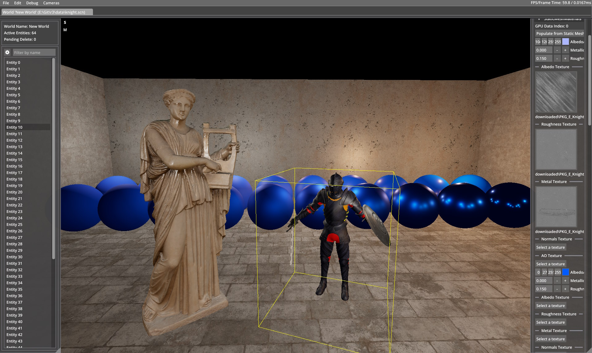

# r3		
 
 

# Setup
1. Install cmake v3.8 or higher
2. Install vcpkg
	- git clone https://github.com/Microsoft/vcpkg.git
	- run .\vcpkg\bootstrap-vcpkg.bat
3. Install Vulkan SDK from https://vulkan.lunarg.com/sdk/home (+ restart afterwards)
4. Clone + install non-vcpkg dependencies
	- git clone https://github.com/bombomby/optick.git
	- run cmake -D OPTICK_USE_VULKAN=ON -H"." -B"build\cmake" from the optick root directory
	- open optick\build\cmake\Optick.sln (as admin!)
		- build + run install (release)
		- copy the release or debug dlls to data/ (either works)
	- download the latest release of the profiler gui, or build it yourself
5. Run setup-msvc.bat
	Open build/R3.sln
6. (Optional)
	Install AMD Compressonator CLI executable from https://github.com/GPUOpen-Tools/Compressonator/releases/latest/
	add the installation directory to the system PATH environment variable
		e.g.
			set PATH=%PATH%;C:\Compressonator_4.5.52\bin\CLI